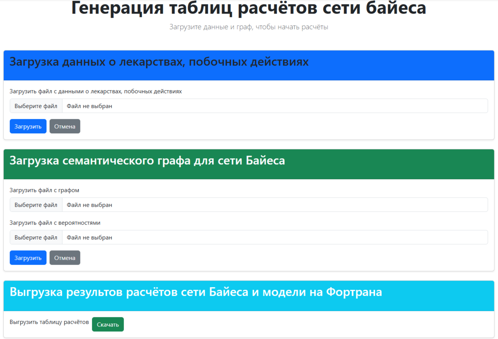

# Назначение проекта
Генерация сравнительной таблицы для сопоставления расчётов сети Байеса и модели на Fortran.

# Создание образа
docker build -t <имя-образа> .
# Запуск контейнера на основне образа
docker run -d -p 8000:8000 --name <название-контейнера> <имя-образа>
# Остановка работы контейнера
docker stop <название-контейнера>
# Удаление контейнера
docker rm <название-контейнера>
# Использование приложения
После запуска контейнера введите в браузере в адресной URL http://localhost:8000.
Откроется страница для загрузки и выгрузки файлов.

